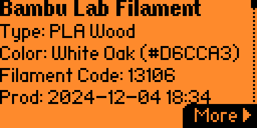
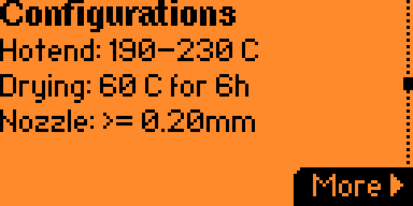

# flipper-bambu

NFC parser for Bambu Lab filament spool RFID tags on [Flipper Zero](https://flipper.net).

<p>
  
  
</p>

## Features

- Parses Bambu Lab spool RFID tags
- Shows material type and detailed variant (e.g., PLA Basic, PLA Matte)
- Displays filament code and color name
- Production date information
- Shows physical properties: weight, diameter, spool width, filament length
- Temperature settings: hotend min/max, drying temp/hours
- Works with stock firmware (no custom flash needed)

## Installation

### Pre-built Plugin

1. Download `bambu_parser.fal` from the [Releases](https://github.com/uzyn/flipper-bambu/releases) page
2. Copy to Flipper Zero SD card: `/ext/apps_data/nfc/plugins/`. You can write to the card directly or via [qFlipper](https://flipper.net/pages/downloads)
3. Restart the NFC app.

## Usage

1. Scan a Bambu Lab spool with the NFC app (or load a saved dump)
    - You can skip the key matching step on the next screen once the Bambu tag is read. This step is not needed.
2. The "Bambu Lab Spool" section will appear showing:
   - Material type and detailed variant
   - Filament code and color name
   - Production date
   - Temperature settings (hotend min/max, drying temp/hours)
   - Physical properties (weight, diameter, spool width, length)

## Build from Source

1. Clone the repository:
   ```bash
   git clone --recursive https://github.com/uzyn/flipper-bambu.git
   cd flipper-bambu
   ```

   If you have cloned the repository, run `git submodule update --init --recursive` instead.

2. Build the plugin:
   ```bash
   make build
   ```
   Output: `dist/bambu_parser.fal`

3. Copy `dist/bambu_parser.fal` to Flipper Zero SD card: `/ext/apps_data/nfc/plugins/`


## Running Tests

```bash
make test
```

## Credits

- Filament database sourced from [queengooborg/Bambu-Lab-RFID-Library](https://github.com/queengooborg/Bambu-Lab-RFID-Library)
- Tag format research from [Bambu-Research-Group/RFID-Tag-Guide](https://github.com/Bambu-Research-Group/RFID-Tag-Guide)

## License

This project is for educational and legitimate use only. No warranty provided.
