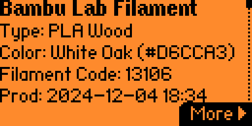
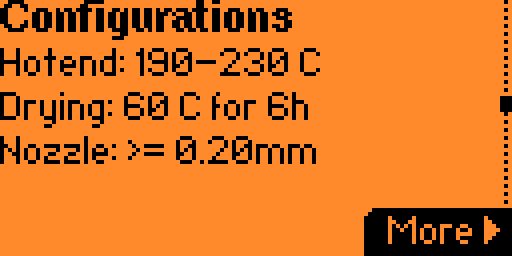

# flipper-bambu

NFC parser for Bambu Lab filament spool RFID tags on [Flipper Zero](https://flipper.net).

[](https://github.com/uzyn/flipper-bambu/actions/workflows/ci.yml)
[](https://github.com/uzyn/flipper-bambu/releases)
[](https://github.com/uzyn/flipper-bambu/releases)

<p>
  
  
</p>

## Features

- Parses Bambu Lab spool RFID tags
- Shows material type and detailed variant (e.g., PLA Basic, PLA Matte)
- Displays filament code and color name
- Production date information
- Shows physical properties: weight, diameter, spool width, filament length
- Temperature settings: hotend min/max, drying temp/hours
- Works with stock firmware (no custom flash needed)

Watch the [demo video](https://www.youtube.com/watch?v=iJgRLGE2dqY) on YouTube.

## Installation

1. Download `bambu_parser.fal` from the [Releases](https://github.com/uzyn/flipper-bambu/releases) page
2. Copy to Flipper Zero SD card: `/ext/apps_data/nfc/plugins/`. You can write to the card directly or via [qFlipper](https://flipper.net/pages/downloads)
3. Disconnect USB (see the note under [Usage](#usage)), then restart the NFC app.

## Usage

1. Scan a Bambu Lab spool with the NFC app (or load a saved dump)
    - You can skip the key matching step on the next screen once the Bambu tag is read. This step is not needed.
2. The "Bambu Lab Spool" section will appear showing:
   - Material type and detailed variant
   - Filament code and color name
   - Production date
   - Temperature settings (hotend min/max, drying temp/hours)
   - Physical properties (weight, diameter, spool width, length)

> **Unplug USB before scanning.** With a USB host session attached — qFlipper especially — the NFC app can exhaust the heap mid-read and the Flipper reboots with "Out of memory". [See #3](https://github.com/uzyn/flipper-bambu/issues/3).   

## Build from Source

There are two build paths, and both produce the same release-mode
`dist/bambu_parser.fal`.

> **Note for contributors:** both paths are release builds, so `furi_assert`
> compiles to nothing in every artifact this repo ships. It is gated on
> `#ifdef FURI_DEBUG` (`furi/core/check.h:77`), and only `DEBUG=1` builds define
> `FURI_DEBUG`. Do not read `NDEBUG` as the signal — fbt defines it in every
> configuration, `DEBUG=1` included. Use `furi_check`, or an explicit `if`, for
> any invariant that has to hold in production — an assert will not survive into
> the released `.fal`.

### ufbt — fast, recommended

Builds against the Flipper SDK that `ufbt` downloads for you. No firmware
submodule, no firmware toolchain, a build takes seconds. Use this for
day-to-day work on the plugin.

1. Clone the repository (no `--recursive` needed) and install
   [ufbt](https://github.com/flipperdevices/flipperzero-ufbt):
   ```bash
   git clone https://github.com/uzyn/flipper-bambu.git
   cd flipper-bambu
   pip install --upgrade ufbt
   ```

2. Build the plugin:
   ```bash
   make ufbt-build
   ```
   Output: `dist/bambu_parser.fal`

3. Deploy straight to a connected Flipper Zero:
   ```bash
   make ufbt-deploy
   ```
   This writes `/ext/apps_data/nfc/plugins/bambu_parser.fal`. Restart the NFC
   app to load it. If you have more than one serial device attached, pass the
   port explicitly:
   `make ufbt-deploy FLIPPER_PORT=/dev/cu.usbmodemflip_XXXXXXXX`

### fbt — full firmware tree

Builds inside a checkout of `flipperzero-firmware` (a ~500 MB submodule plus
its toolchain). Use this when you need to change firmware code alongside the
plugin, or to reproduce a release build exactly. This is what CI uses to
produce the released artifact.

1. Clone the repository with submodules:
   ```bash
   git clone --recursive https://github.com/uzyn/flipper-bambu.git
   cd flipper-bambu
   ```

   If you have already cloned the repository, run `git submodule update --init --recursive` instead.

2. Build the plugin:
   ```bash
   make build
   ```
   Output: `dist/bambu_parser.fal`

3. Copy `dist/bambu_parser.fal` to Flipper Zero SD card: `/ext/apps_data/nfc/plugins/`


## Running Tests

```bash
make test
```

## Credits

- Filament database sourced from [queengooborg/Bambu-Lab-RFID-Library](https://github.com/queengooborg/Bambu-Lab-RFID-Library)
- Tag format research from [Bambu-Research-Group/RFID-Tag-Guide](https://github.com/Bambu-Research-Group/RFID-Tag-Guide)

## License

GPL-3.0 ⋅ U-Zyn Chua [https://uzyn.com](https://uzyn.com)
